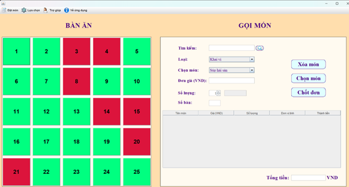

# XÂY DỰNG ỨNG DỤNG GỌI MÓN TẠI NHÀ HÀNG

Trong bối cảnh công nghệ ngày càng phát triển, việc ứng dụng công nghệ thông tin vào quản lý nhà hàng đã trở thành một xu hướng tất yếu. Sự kết hợp giữa công nghệ và dịch vụ mang lại nhiều tiện ích và hiệu quả vượt trội. Đề tài “Ứng dụng gọi món nhà hàng” là một giải pháp công nghệ hiện đại nhằm cải thiện quy trình phục vụ khách hàng và quản lý dịch vụ kinh doanh của nhà hàng. 

## Mô tả ứng dụng

Ứng dụng này cho phép quản lý thực đơn, quản lý nhân viên và quản lý gọi món ăn, đồng thời tích hợp chức năng theo dõi tình trạng bàn và thống kê doanh thu. Việc xây dựng ứng dụng này không chỉ mang lại sự tiện lợi cho khách hàng mà còn hỗ trợ tích cực trong việc tối ưu hoá hoạt động của nhà hàng, đáp ứng nhu cầu ngày càng cao của ngành dịch vụ. 
## Công nghệ sử dụng
- Ngôn ngữ lập trình: Java
- Lập trình giao diện: Java Swing và AWT
- Môi trường lập trình: Eclipse IDE for Java Developers
- Cơ sở dữ liệu: MariaDB (MySQL)
- Phần mềm hỗ trợ: XAMPP

## Phân tích và thiết kế ứng dụng
- Use-case Diagram
  
- Database Diagram
  

## Giao diện chính
- Đăng nhập
    
- Gọi món
    
- Quản lý thực đơn
    
- Quản lý nhân viên
    
- Thống kê
    
- Hóa đơn
    
## Hướng phát triển

Ta thấy ứng dụng này đã có khá nhiều chức năng phục vụ cho việc quản lý gọi món nhà hàng. Tuy nhiên vẫn còn nhiều điều cần cải thiện nếu muốn áp dụng nó vào thực tế. Cụ thể là:

    - Ứng dụng phần lớn tập trung vào phần gọi món và thanh toán trong nhà hàng được thao tác bởi nhân viên nhà hàng. Chúng ta có thể thêm những chức năng quản lý khác như nhân lực, nguyên liệu, … để ứng dụng có thể quản lý trong nhà hàng tốt hơn. 
    - Ngoài ra, chúng ta cũng có thể phát triển nó thêm một hướng cho khách hàng sử dụng để có thể dễ dàng thao tác mà không nhất thiết phải để nhân viên thao tác.
